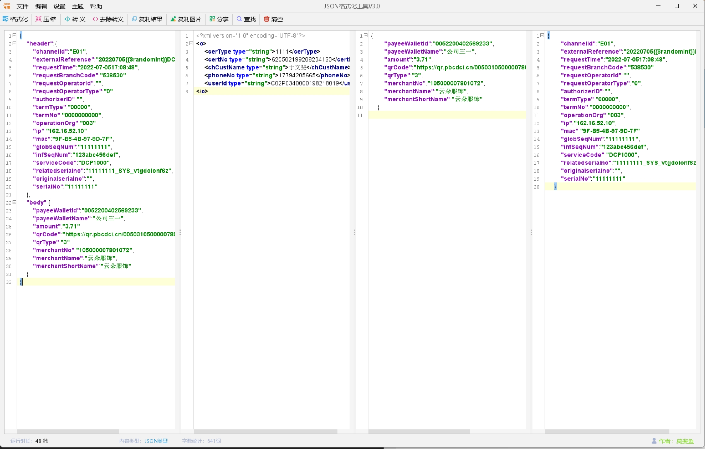

# ViewJSON
#### 介绍
JSON格式化工具类

#### 软件架构
swing + flatlaf + rsyntaxtextarea

#### 框架层需要解决的问题
1. 解决事件绑定的分离，页面结构分离，形成框架分离✅
2. 解决配置文件获取,配置保存✅
3. 解决打包后的日志打印问题,方便打包后的调试
4. 封装自己的组件扫描机制,IOC容器,依赖注入，组件之间解耦合
   
#### 产品层面需要完善的清单(第一版)
1. 记录格式化生成次数，显示当前时间✅
2. 对json数据进行json类型检验❌
3. 点击格式化按钮新增选项卡〔用MD5对json数据进行签名，如果第一次按钮和第二次按钮生成的md5值相同，则不生成新的选项卡，否则，生成新的选项卡，展示格式化后的数据〕
4. 对右侧json对象的关键字颜色进行调整优化，冒号后面加空格✅
5. 左侧功能区，增加压缩按钮✅
6. 右侧增加行号✅️
7. 左右两侧实行宽窄可变的布局样式✅
8. 主题可更换✅
9. 是否可换行，可配置✅
10. 结合市面上所有的json工具，优化布局，优化功能✅
11. 增加搜索功能

#### 产品层面需要完善的清单(第二版)
1. 主题可更换✅
2. 增加json树结构
3. 增加选项卡功能(内容MD5值检验)
4. 底部增加呼吸灯效果
5. 主要按钮操作绑定快捷键
6. 格式化后的json保存图片功能✅
7. 增加XML格式化
8. 增加输入框回退功能（ctrl+z 和 ctrl + shift + z）
9. 增加配置 json是否可换行支持✅
10. 搜索功能完善
11. 优化代码结构，MVC分层
12. 打包exe

#### 产品层面需要完善的清单(第三版)
1. 工具条新增新建按钮，点击新建时，增加新的选项卡(选项卡竖排，可关闭，类似于plsql界面)⭐⭐
2. 删除左侧富文本框，增加JSON树显示⭐⭐⭐⭐⭐
3. 系统托盘驻留功能⭐⭐
4. 最下方显示，工具格式化次数。菜单栏新增菜单显示IO操作统计(软件打开次数，格式化次数，保存文件次数，保存图片次数，软件打开时长〔打开到关闭的时间汇总〕)
5. 搜索功能
6. 窗口大小本地文件记录✅
7. 增加记录上一次选定的主题颜色✅
8. 报文分享为二维码️✌️(`优化`)✅
9. 增加按钮栏工具是否显示，某个按钮是否显示功能
10. 增加复制图片功能✅
11. 格式化后的json保存图片功能✅
12. 打包exe ✅https://blog.csdn.net/zzhceo/article/details/121556283

#### 产品层面需要完善的清单(第四版)
1. 图片预览功能开发(图片滚动查看)❌
2. 配置读取优化：启动软件，加载所有文件里面的所有配置到配置类，减少后续的IO操作，退出窗口时，将所有配置类的信息，保存进文件
3. 二维码面板弹窗优化✅
4. 菜单栏是否显示，通过右键菜单控制✅
5. 系统托盘驻留❌
6. 优化是否去除空格功能✅
7. 查找替换
8. 增加状态栏，显示是否是正规json对象，通过黄灯和绿灯来标识
9. 保证所有组件初始化结束，再注册事件✅

#### 产品层面需要完善的清单(第五版)
1. 菜单栏增加：图片分享比例（70%，100%，120%，150%，200%）(低，中，高，最佳)✅
2. 收藏夹
3. 最近文件记录
4. 状态栏，显示文件类型（JSON文件 文本文件 二维码串）,文件长度（5045词），软件打开时长✅
5. 选项卡可以横向 也可以纵向 还可以多窗口并排(最好开发出文件对比功能)
6. 重写RSyntaxTextArea组件右键菜单：双引号转义,替换中文双引号，转大写，转小写，中文转Unicode,复制图片到剪贴板
   参考：https://blog.csdn.net/hw1287789687/article/details/84761201

#### 产品层面需要完善的清单(第六版)
1. 图片预览功能开发(图片滚动查看)❌
2. 配置读取优化：启动软件，加载所有文件里面的所有配置到配置类，减少后续的IO操作，退出窗口时，将所有配置类的信息，保存进文件⭐⭐⭐⭐⭐
3. 二维码面板弹窗优化✅
4. 设置菜单中增加外观菜单，显示工具栏和菜单栏✅
5. 系统托盘驻留❌
6. 去除空格功能暂时关闭✅
7. 查找替换⭐⭐⭐⭐⭐
8. 增加状态栏，状态栏显示文件类型：JSON文件 文本文件 网站地址，软件打开时长，字数统计✅
9. 优化文件选择弹框❌
10. 编辑框右键菜单优化⭐⭐⭐⭐⭐
11. 增加是否显示行号✅
12. 中文和Unicode编码互转功能开发✅
13. 输出报文图片质量配置功能开发✅

#### 产品层面需要完善的清单(第七版)
1. 配置读取优化：启动软件，加载所有文件里面的所有配置到配置类，减少后续的IO操作，退出窗口时，将所有配置类的信息，保存进文件
2. 编辑框右键菜单优化✅
3. 查找,替换,高亮功能✅
4. 编辑框右键或新建增加并排窗口,可进行左右拖动,最多建立四个窗口，可并排。
5. 短信息弹框组件封装。
6. 按钮点击等待处理状态。（也可以通过短消息的内容变化来提示处理）
7. 格式化历史记录（根据压缩后的md5值，确定是否保存历史记录）
8. 优化xml格式化，压缩功能

#### 产品层面需要完善的清单(第八版)
1. 重写编辑器的右键菜单，增加新建按钮✅
2. 点击按钮时，可以新建并列的编辑框，最多能新建三个✅
3. 每一个框都可以在右上角新增悬浮关闭按钮或者悬浮工具条，可以格式化，压缩等操作❌(不做，用右键菜单代替)
4. 那个编辑框处于鼠标激活状态，工具栏功能就可以先作用于那个框✅
5. 菜单栏增加布局方式：横向布局，田字布局，可以上下左右，四个框❌(不做，右键新建时，可以控制)
6. 编辑框可以新建后，存储在数组里面，或者map里面，新增框的时候，可以方便的取出来显示✅

#### 产品层面需要完善的清单(第九版)
1. 重写RSyntaxTextArea编辑器的右键菜单，增加新建按钮。(重点，难点)⭐⭐⭐⭐⭐✅
2. 新建并排窗口的组件优化，能无限制的新建并排组件，简单调用。(重点，难点)
   ```
   思路：鼠标右键弹出菜单，当前焦点组件，获取焦点组件的父组件容器，
   当有多个编辑框时，父组件必定是JSplitPane,然后给JSplitPane组件的
   setRightComponent属性创建新的JSplitPane组件，放入右侧，计算宽度，
   就可以实现此功能，无限制新建。
   ```
3. 每一个框都可以在右上角新增悬浮关闭按钮或者悬浮工具条，可以格式化，压缩等操作❌
4. 优化好并排窗口以后，鼠标右键弹出菜单，向右分割或者向下分割
5. 单个并排窗口大小变化时,其他窗口缓慢渐进按比例变化宽度✅
6. 窗口大小变化时,并排窗口的大小比例变化宽度✅
7. 并排窗口的关闭功能，关闭按钮界面✅
8. 增加菜单：语言类别，自动识别 json xml java JavaScript sql 等等，供用户选择
   ```
   底座类：存放所有初始化及动态变化的参数
   并排窗口菜单名称：水平分割 垂直分割 向右分割 向下分割
   ```
9. 系统资源文件加载优化✅
   ```
   扫描系统目录下Properties文件是否存在,如果不存在，加载系统
   目录下默认的Properties资源文件到实体类对象，注入到全局属性，
   如果存在，注入到全局属性，供各组件使用，在系统关闭时，保存当
   前实体类的内容到系统目录的磁盘
   ```
10. 格式化JSON时，value值中的空格会被去除
11. 全局字体大小调整(解决字体太大,导致界面显示不好看)

#### 产品层面需要完善的清单(第十版)
1. 全局字体设置,字体选择框界面绘制,设置字体后界面变的紧凑问题处理,只有当设置14号字体时，界面不会改变（原因：svg图标变大导致）
2. 菜单、工具条,LOGO,图标名称全部放到Properties文件，可以默认编辑框的右键菜单
3. 收藏夹JList功能，点击收藏时，弹出提示，输入收藏的名称，菜单栏增加收藏列表，可以用到表格组件
4. PropertySource注解扫描注入时,配置类增加校验注解,是否可为空,是否指定默认值,直接可以打印字段注入异常提示框
5. 菜单栏和工具栏代码重构,默认编辑框右键菜单的写法，进行代码重构
   ```
   可以借鉴：
      RsTextArea文本编辑器的右键菜单
      swing-helper项目的菜单构建
   ```
6. 软件使用统计面板
7. 弹框提示功能，重构别人的代码，减小体积，增加代码契合度
8. 自动获取语言类型的判断还需要优化
9. 整合日志框架，控制台和用户日志目录输出日志文件,项目打包后,日志不保存
10. 重写状态栏：JXStatusBar,以解决更换主题时，状态栏字体变大问题
11. 增加菜单：语言类别，自动识别 json xml java JavaScript sql 等等，供用户选择
13. 打包exe，不依赖jdk


#### 目前存在的问题：
1. 编辑框的禁止编辑，自动换行，显示行号，图片质量，中文转码应该为全局设置，而不是一个编辑器一个编辑器设置(已解决)✅
2. 状态栏的内容类型，字数统计，应该随着编辑框焦点的变化而变化(已解决)✅
3. 菜单栏的清空按钮空指针(已解决)✅
4. 分享功能异常(已解决)✅
5. 查找功能异常(已解决)✅
6. 全局组件的键全局注册，常量引用⭐
7. 编辑框最多可以创建并排四个针(已解决)✅
8. 编辑框创建四个后，编辑框位置拖动你渐近变化问题处理(已解决)✅
9. 编辑框新建四个后，窗口最大化，还原的操作保证各编辑框的位置均匀分布(已解决)✅
10. 主题改变或字体改变后，图标尺寸(变大)和编辑框字体(变小)被改变的问题处理
11. 主题改变后，编辑框主题不变(已解决)✅
12. 新建编辑框后，编辑框主题与当前主题不对应(已解决)✅
13. 项目打包后，读取不到resource资源文件下的配置✅
```
JXMultiSplitPane:又发现了新的可分割窗口,可以考虑拉新的分支进行整合，封装
可以模仿PhotoShop的窗口分割功能,多窗口并排
```




>作者：莫斐鱼
> 
>2023年11月23日
